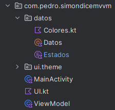
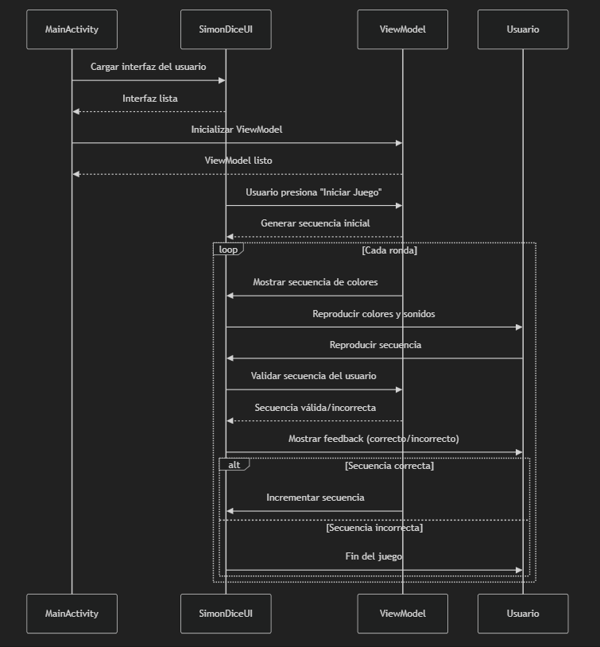

# Simon Dice - Pedro Piñeiro Ordax - 2º DAM

## Descripción
Juego de Simon Dice desarrollado en Android Studio con Kotlin, Jetpack Compose y con estructura MVVM

## En que consiste

* Tenemos un panel central con 4 botones de colores
* El juego empieza cuando se pulsa el botón de "START"
* Se genera una secuencia de colores que el usuario debe repetir
* Si el usuario acierta, se añade un color más a la secuencia
* El juego termina cuando el usuario falla

## Implementación del MVVM

* **Model**: Contiene la lógica del juego, lo forma el paquete "datos", con Colores, Datos y Estados
* **View**: Contiene la interfaz de usuario, únicamente la UI
* **ViewModel**: Contiene la lógica de la interfaz de usuario, la clase ViewModel

## View (UI)

La interfaz de usuario del juego Simon Dice está construida utilizando Jetpack Compose. A continuación se describen los componentes principales de la UI:

`SimonDiceUI`: Esta función composable es la principal de la aplicación y se encarga de organizar los diferentes elementos de la interfaz de usuario

- **Imagen de Fondo**: Se muestra una imagen de fondo que ocupa toda la pantalla
- **Panel de Información**: Contiene dos textos que muestran el récord y el número de aciertos del usuario
- **Botones de Colores**: Cuatro botones de colores (rojo, verde, azul y amarillo) que el usuario debe presionar en la secuencia correcta
- **Botón de Inicio**: Un botón de "START" que inicia el juego

`crearAciertosText`: Función composable que muestra el número de aciertos del usuario

`crearRecordText`: Función composable que muestra el récord máximo del usuario en el juego

`crearColorButton`: Función composable que crea un botón de color. Cada botón tiene un color específico y se activa o desactiva según el estado del juego

`crearStartButton`: Función composable que muestra el botón de inicio. Este botón inicia el juego y genera una secuencia de colores aleatoria

## ViewModel

La clase ViewModel contiene la lógica de la interfaz de usuario y maneja el estado del juego. A continuación se describen los métodos y propiedades principales de esta clase:

### Propiedades

`LiveData`: Se utilizan para observar cambios en el estado del juego y actualizar la UI en consecuencia

`recordLiveData`: Almacena el récord del usuario

`aciertosLiveData`: Almacena el número de aciertos del usuario

`colorRojoLiveData`, colorVerdeLiveData, colorAzulLiveData, colorAmarilloLiveData: Almacenan los colores de los botones

`estadoLiveData`: Almacena el estado actual del juego (INICIO o ADIVINANDO)

### Métodos

`addColor`: Añade un color a la secuencia del usuario y verifica si ha ganado o perdido

`getRandom`: Devuelve la lista de números aleatorios generados por la máquina

`clearListaRandoms`: Limpia la lista de números aleatorios

`clearListaColores`: Limpia la lista de colores seleccionados por el usuario

`winOrLose`: Verifica si el usuario ha ganado o perdido el juego

`auxWinOrLose`: Función auxiliar para verificar si la secuencia del usuario coincide con la secuencia de la máquina

`onWin`: Lógica para cuando el usuario gana una ronda

`onLose`: Lógica para cuando el usuario pierde una ronda

`cambiosColores`: Cambia los colores según la secuencia aleatoria generada

`getColorRed, getColorGreen, getColorBlue, getColorYellow`: Devuelven los colores normales de los botones

## Model (Datos)

### `Colores`
Enum que define los colores utilizados en el juego y sus valores asociados

### `ColoresIluminados`
Enum que define los colores normales e iluminados utilizados en el juego

### `Datos`
Objeto que almacena los datos del juego, como el número de aciertos, el récord, y las listas de números aleatorios y colores seleccionados por el usuario

### `Estados`
Enum que gestiona los estados de la aplicación, como INICIO y ADIVINANDO

## Diagrama

